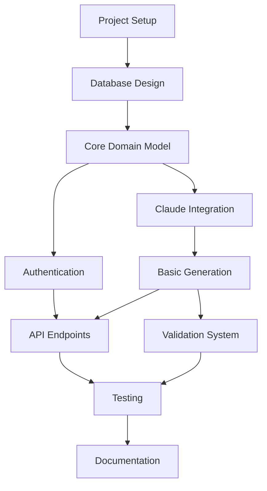

# Campaign Generator API - Technical Specification

## 1. Project Overview

### Vision Statement

To democratize campaign creation for Dungeons & Dragons 5th Edition by providing a sophisticated AI-powered service that generates unique, high-quality campaigns on-demand, enabling Dungeon Masters of all skill levels to craft engaging stories without the time-intensive process of manual design.

### Core Value Proposition

- **Instant Campaign Generation**: Create complete, playable D&D 5e campaigns in minutes rather than weeks
- **AI-Powered Creativity**: Leverage Claude's advanced language model to generate unique content that follows established D&D 5e rules and tropes
- **Quality Assurance**: Built-in validation ensures all generated content meets D&D 5e standards
- **Customization Control**: User preferences for theme, difficulty, setting, and style guide generation
- **Continuous Enhancement**: Support for campaign continuation and expansion as players progress

### Target Users and Use Cases

#### Primary Users
1. **New Dungeon Masters**: Players transitioning to DM role who need complete campaign frameworks
2. **Time-Constrained DMs**: Experienced DMs who want to focus on storytelling rather than world-building
3. **Educational Institutions**: Gaming clubs, schools, and universities running D&D programs
4. **Content Creators**: YouTubers, streamers, and writers creating D&D content

#### Secondary Users
1. **Professional Game Masters**: Looking for inspiration or supplemental content
2. **Tabletop Gaming Stores**: Providing campaign generation services to customers
3. **D&D Publishers**: Generating content for books, adventures, and digital products

#### Key Use Cases
- **One-Shot Generation**: Quick campaigns for single-session play
- **Campaign Arcs**: Multi-session storylines with branching narratives
- **World Building**: Complete settings with lore, factions, and locations
- **Character Integration**: Campaigns tailored to specific player characters
- **Thematic Campaigns**: Genre-specific adventures (horror, mystery, exploration)
- **Difficulty Scaling**: Adjustable challenge ratings and encounter design

### Success Metrics
- Campaign generation success rate (>95%)
- User satisfaction scores (>4.5/5)
- Average generation time (<5 minutes)
- D&D 5e rule compliance (>99%)
- Monthly active users and campaign generations

## 2. Technical Architecture

### System Architecture Overview

```
┌─────────────────┐    ┌─────────────────┐    ┌─────────────────┐
│   API Gateway   │────│  Campaign Gen   │────│   AI Service    │
│   (FastAPI)     │    │   Service       │    │  (Claude API)   │
└─────────────────┘    └─────────────────┘    └─────────────────┘
         │                       │                       │
         │                       │                       │
┌─────────────────┐    ┌─────────────────┐    ┌─────────────────┐
│   Auth Service  │    │   Validation    │    │  Content Cache  │
│   (JWT/OAuth)   │    │   Engine        │    │    (Redis)      │
└─────────────────┘    └─────────────────┘    └─────────────────┘
         │                       │                       │
         └───────────────────────┼───────────────────────┘
                                 │
                    ┌─────────────────┐
                    │   Database      │
                    │  (PostgreSQL)   │
                    └─────────────────┘
```

### Component Interactions

1. **API Gateway**: Entry point handling authentication, rate limiting, and request routing
2. **Campaign Generator Service**: Core business logic for campaign generation orchestration
3. **AI Service**: Integration with Anthropic Claude API for content generation
4. **Validation Engine**: Ensures D&D 5e compliance and content quality
5. **Content Cache**: Redis-based caching for generated content and templates
6. **Database**: Persistent storage for campaigns, templates, and user data

### Domain Model

#### Core Entities

```python
# Campaign Entity
class Campaign:
    id: UUID
    name: str
    description: str
    theme: CampaignTheme
    difficulty: DifficultyLevel
    world: World
    story_hook: StoryHook
    story_arcs: List[StoryArc]
    key_npcs: List[NPC]
    key_locations: List[Location]
    starting_level: int
    party_size: PartySize
    expected_duration: Duration
    quality_score: float
    generated_at: datetime
    user_preferences: UserPreferences
    status: GenerationStatus

# World Entity
class World:
    id: UUID
    name: str
    description: str
    geography: Geography
    cultures: List[Culture]
    magic_system: MagicSystem
    factions: List[Faction]
    history: WorldHistory

# Story Elements
class StoryHook:
    id: UUID
    title: str
    description: str
    hook_type: HookType
    stakes: str
    complications: List[str]

class StoryArc:
    id: UUID
    title: str
    description: str
    acts: List[Act]
    climax: str
    resolution: str

# Characters and Locations
class NPC:
    id: UUID
    name: str
    race: Race
    character_class: CharacterClass
    background: Background
    personality: Personality
    motivation: str
    role_in_story: str

class Location:
    id: UUID
    name: str
    type: LocationType
    description: str
    significance: str
    encounters: List[Encounter]
```

#### Value Objects

```python
class CampaignTheme(Enum):
    FANTASY = "fantasy"
    HORROR = "horror"
    MYSTERY = "mystery"
    EXPLORATION = "exploration"
    POLITICAL_INTRIGUE = "political_intrigue"
    WAR = "war"
    SUPERNATURAL = "supernatural"
    CUSTOM = "custom"

class DifficultyLevel(Enum):
    EASY = "easy"
    MEDIUM = "medium"
    HARD = "hard"
    DEADLY = "deadly"

class PartySize(Enum):
    SOLO = "solo"
    DUO = "duo"
    SMALL = "small"  # 3-4 players
    MEDIUM = "medium"  # 5-6 players
    LARGE = "large"  # 7+ players

class Duration(Enum):
    ONE_SHOT = "one_shot"
    SHORT = "short"  # 3-5 sessions
    MEDIUM = "medium"  # 6-12 sessions
    LONG = "long"  # 13-20 sessions
    EPIC = "epic"  # 20+ sessions
```

### Database Schema Design

#### Core Tables

```sql
-- Campaigns table
CREATE TABLE campaigns (
    id UUID PRIMARY KEY DEFAULT gen_random_uuid(),
    name VARCHAR(255) NOT NULL,
    description TEXT,
    theme campaign_theme NOT NULL,
    difficulty difficulty_level NOT NULL,
    world_id UUID REFERENCES worlds(id),
    starting_level INTEGER NOT NULL CHECK (starting_level >= 1 AND starting_level <= 20),
    party_size party_size NOT NULL,
    expected_duration duration NOT NULL,
    quality_score DECIMAL(3,2) CHECK (quality_score >= 0 AND quality_score <= 5),
    generated_at TIMESTAMP WITH TIME ZONE DEFAULT NOW(),
    user_id UUID REFERENCES users(id),
    status generation_status DEFAULT 'generating',
    created_at TIMESTAMP WITH TIME ZONE DEFAULT NOW(),
    updated_at TIMESTAMP WITH TIME ZONE DEFAULT NOW()
);

-- Worlds table
CREATE TABLE worlds (
    id UUID PRIMARY KEY DEFAULT gen_random_uuid(),
    name VARCHAR(255) NOT NULL,
    description TEXT,
    geography JSONB,
    magic_system JSONB,
    created_at TIMESTAMP WITH TIME ZONE DEFAULT NOW()
);

-- Story hooks table
CREATE TABLE story_hooks (
    id UUID PRIMARY KEY DEFAULT gen_random_uuid(),
    campaign_id UUID REFERENCES campaigns(id) ON DELETE CASCADE,
    title VARCHAR(255) NOT NULL,
    description TEXT,
    hook_type hook_type NOT NULL,
    stakes TEXT,
    complications JSONB,
    created_at TIMESTAMP WITH TIME ZONE DEFAULT NOW()
);

-- Story arcs table
CREATE TABLE story_arcs (
    id UUID PRIMARY KEY DEFAULT gen_random_uuid(),
    campaign_id UUID REFERENCES campaigns(id) ON DELETE CASCADE,
    title VARCHAR(255) NOT NULL,
    description TEXT,
    acts JSONB,
    climax TEXT,
    resolution TEXT,
    arc_order INTEGER NOT NULL,
    created_at TIMESTAMP WITH TIME ZONE DEFAULT NOW()
);

-- NPCs table
CREATE TABLE npcs (
    id UUID PRIMARY KEY DEFAULT gen_random_uuid(),
    campaign_id UUID REFERENCES campaigns(id) ON DELETE CASCADE,
    name VARCHAR(255) NOT NULL,
    race race_type,
    character_class class_type,
    background background_type,
    personality JSONB,
    motivation TEXT,
    role_in_story TEXT,
    created_at TIMESTAMP WITH TIME ZONE DEFAULT NOW()
);

-- Locations table
CREATE TABLE locations (
    id UUID PRIMARY KEY DEFAULT gen_random_uuid(),
    campaign_id UUID REFERENCES campaigns(id) ON DELETE CASCADE,
    name VARCHAR(255) NOT NULL,
    type location_type NOT NULL,
    description TEXT,
    significance TEXT,
    encounters JSONB,
    created_at TIMESTAMP WITH TIME ZONE DEFAULT NOW()
);

-- User preferences table
CREATE TABLE user_preferences (
    id UUID PRIMARY KEY DEFAULT gen_random_uuid(),
    user_id UUID REFERENCES users(id) ON DELETE CASCADE,
    preferred_themes JSONB,
    preferred_difficulty difficulty_level,
    preferred_setting setting_type,
    custom_prompts JSONB,
    created_at TIMESTAMP WITH TIME ZONE DEFAULT NOW(),
    updated_at TIMESTAMP WITH TIME ZONE DEFAULT NOW()
);

-- Generation requests table (for async processing)
CREATE TABLE generation_requests (
    id UUID PRIMARY KEY DEFAULT gen_random_uuid(),
    user_id UUID REFERENCES users(id),
    request_data JSONB,
    status request_status DEFAULT 'pending',
    campaign_id UUID REFERENCES campaigns(id),
    error_message TEXT,
    started_at TIMESTAMP WITH TIME ZONE,
    completed_at TIMESTAMP WITH TIME ZONE,
    created_at TIMESTAMP WITH TIME ZONE DEFAULT NOW()
);
```

#### Enums and Types

```sql
-- Custom enum types
CREATE TYPE campaign_theme AS ENUM ('fantasy', 'horror', 'mystery', 'exploration', 'political_intrigue', 'war', 'supernatural', 'custom');
CREATE TYPE difficulty_level AS ENUM ('easy', 'medium', 'hard', 'deadly');
CREATE TYPE party_size AS ENUM ('solo', 'duo', 'small', 'medium', 'large');
CREATE TYPE duration AS ENUM ('one_shot', 'short', 'medium', 'long', 'epic');
CREATE TYPE generation_status AS ENUM ('generating', 'completed', 'failed', 'validating');
CREATE TYPE hook_type AS ENUM ('personal', 'mysterious', 'threatening', 'opportunity', 'cosmic');
CREATE TYPE race_type AS ENUM ('human', 'elf', 'dwarf', 'halfling', 'dragonborn', 'tiefling', 'half-elf', 'half-orc', 'gnome');
CREATE TYPE class_type AS ENUM ('barbarian', 'bard', 'cleric', 'druid', 'fighter', 'monk', 'paladin', 'ranger', 'rogue', 'sorcerer', 'warlock', 'wizard');
CREATE TYPE background_type AS ENUM ('acolyte', 'criminal', 'entertainer', 'folk_hero', 'guild_artisan', 'hermit', 'noble', 'outlander', 'sage', 'sailor', 'soldier', 'urchin');
CREATE TYPE location_type AS ENUM ('city', 'town', 'village', 'dungeon', 'forest', 'mountain', 'desert', 'coast', 'underwater', 'planar');
CREATE TYPE setting_type AS ENUM ('medieval_fantasy', 'dark_fantasy', 'high_fantasy', 'urban_fantasy', 'post_apocalyptic', 'steampunk', 'cyberpunk');
CREATE TYPE request_status AS ENUM ('pending', 'processing', 'completed', 'failed');
```

### Deployment Architecture

```
┌─────────────────────────────────────────────────────────────┐
│                    Load Balancer (nginx)                     │
└─────────────────┬───────────────────────────────────────────┘
                  │
    ┌─────────────┼─────────────┐
    │             │             │
┌───▼───┐    ┌────▼────┐   ┌────▼────┐
│ API   │    │ API     │   │ API     │
│Server │    │ Server  │   │ Server  │
│ 1     │    │  2      │   │  3      │
└───┬───┘    └────┬────┘   └────┬────┘
    │             │             │
    └─────────────┼─────────────┘
                  │
        ┌─────────▼─────────┐
        │   Redis Cluster   │
        │  (Cache & Queue)  │
        └─────────┬─────────┘
                  │
        ┌─────────▼─────────┐
        │ PostgreSQL Cluster│
        │  (Primary + Read  │
        │   Replicas)       │
        └───────────────────┘
```

#### Infrastructure Components

1. **Application Servers**: Docker containers running FastAPI application
2. **Database**: PostgreSQL with read replicas for scalability
3. **Cache**: Redis cluster for session storage and content caching
4. **Load Balancer**: nginx for request distribution and SSL termination
5. **Monitoring**: Prometheus + Grafana for metrics and alerting
6. **Logging**: ELK stack (Elasticsearch, Logstash, Kibana)
7. **Backup**: Automated database backups with point-in-time recovery

## 3. Implementation Plan

### Task Breakdown by Domain

#### Phase 1: Foundation (Week 1-2)

**1.1 Project Setup & Infrastructure**
- [ ] Initialize FastAPI project with proper structure
- [ ] Set up PostgreSQL database with migrations
- [ ] Configure Redis for caching
- [ ] Create Docker setup with docker-compose
- [ ] Set up CI/CD pipeline with GitHub Actions
- [ ] Configure monitoring and logging

**1.2 Core Domain Model**
- [ ] Implement base entities and value objects
- [ ] Create repository interfaces
- [ ] Set up database models with SQLAlchemy
- [ ] Implement basic CRUD operations
- [ ] Add data validation layer

**1.3 Authentication & Authorization**
- [ ] Implement JWT-based authentication
- [ ] Create user management system
- [ ] Set up role-based access control
- [ ] Add API key generation for external integrations

#### Phase 2: AI Integration (Week 3-4)

**2.1 Claude API Integration**
- [ ] Set up Anthropic API client
- [ ] Implement basic prompt templates
- [ ] Create AI service layer
- [ ] Add error handling and retries
- [ ] Implement token usage tracking

**2.2 Content Generation Pipeline**
- [ ] Design campaign generation workflow
- [ ] Implement world generation
- [ ] Create story hook generation
- [ ] Build NPC generation system
- [ ] Develop location generation

**2.3 Quality Validation**
- [ ] Create D&D 5e validation rules
- [ ] Implement content quality scoring
- [ ] Add regeneration logic for low-quality content
- [ ] Build manual review queue

#### Phase 3: API Development (Week 5-6)

**3.1 Core API Endpoints**
- [ ] Campaign generation endpoint
- [ ] Campaign retrieval and listing
- [ ] User preference management
- [ ] Generation status tracking

**3.2 Advanced Features**
- [ ] Campaign continuation/expansion
- [ ] Custom prompt management
- [ ] Bulk generation capabilities
- [ ] Export functionality (PDF, JSON, Markdown)

**3.3 API Infrastructure**
- [ ] Implement rate limiting
- [ ] Add request/response caching
- [ ] Set up API documentation with OpenAPI
- [ ] Create SDK generation for multiple languages

#### Phase 4: Quality Assurance (Week 7-8)

**4.1 Testing Infrastructure**
- [ ] Unit test coverage (>90%)
- [ ] Integration tests for API endpoints
- [ ] AI-generated content validation tests
- [ ] Performance and load testing

**4.2 Validation & Compliance**
- [ ] D&D 5e rule compliance checker
- [ ] Content quality assessment
- [ ] Accessibility and inclusivity checks
- [ ] Legal compliance (content ownership, etc.)

**4.3 Monitoring & Analytics**
- [ ] Application performance monitoring
- [ ] AI generation metrics and analytics
- [ ] User behavior tracking
- [ ] Error rate monitoring and alerting

### Prioritized Implementation Order

1. **High Priority (Must-Have for MVP)**
   - Basic campaign generation with Claude integration
   - Core API endpoints for generation and retrieval
   - User authentication and preferences
   - D&D 5e validation and quality scoring

2. **Medium Priority (Should-Have for V1)**
   - Campaign continuation and expansion
   - Advanced customization options
   - Bulk generation capabilities
   - Export functionality

3. **Low Priority (Nice-to-Have)**
   - Multi-language support
   - Advanced analytics dashboard
   - Third-party integrations
   - Mobile application SDK

### Time Estimates

| Component | Estimated Time | Dependencies |
|-----------|----------------|--------------|
| Project Setup | 2 days | None |
| Database Design | 3 days | Project Setup |
| Core Domain Model | 5 days | Database Design |
| Authentication | 3 days | Core Domain Model |
| Claude Integration | 4 days | Core Domain Model |
| Basic Generation | 5 days | Claude Integration |
| API Endpoints | 4 days | Basic Generation |
| Validation System | 3 days | Basic Generation |
| Testing | 5 days | All Components |
| Documentation | 3 days | All Components |

### Dependencies Between Components



## 4. API Design

### OpenAPI Specification

```yaml
openapi: 3.0.3
info:
  title: Campaign Generator API
  description: AI-powered D&D 5e campaign generation service
  version: 1.0.0
  contact:
    email: api@campaign-generator.com

servers:
  - url: https://api.campaign-generator.com/v1
    description: Production server
  - url: http://localhost:8000/v1
    description: Development server

security:
  - bearerAuth: []
  - apiKey: []

paths:
  /campaigns:
    post:
      summary: Generate a new campaign
      description: Generate a complete D&D 5e campaign based on user preferences
      operationId: generateCampaign
      requestBody:
        required: true
        content:
          application/json:
            schema:
              $ref: '#/components/schemas/CampaignRequest'
      responses:
        '202':
          description: Campaign generation started
          content:
            application/json:
              schema:
                $ref: '#/components/schemas/GenerationResponse'
        '400':
          $ref: '#/components/responses/BadRequest'
        '401':
          $ref: '#/components/responses/Unauthorized'
        '429':
          $ref: '#/components/responses/RateLimited'

    get:
      summary: List user campaigns
      description: Retrieve a list of campaigns generated by the authenticated user
      operationId: listCampaigns
      parameters:
        - name: limit
          in: query
          schema:
            type: integer
            minimum: 1
          default: 20
        - name: offset
          in: query
          schema:
            type: integer
            minimum: 0
          default: 0
        - name: status
          in: query
          schema:
            type: string
            enum: [generating, completed, failed]
      responses:
        '200':
          description: List of campaigns
          content:
            application/json:
              schema:
                $ref: '#/components/schemas/CampaignList'

  /campaigns/{campaignId}:
    get:
      summary: Get campaign details
      description: Retrieve detailed information about a specific campaign
      operationId: getCampaign
      parameters:
        - name: campaignId
          in: path
          required: true
          schema:
            type: string
            format: uuid
      responses:
        '200':
          description: Campaign details
          content:
            application/json:
              schema:
                $ref: '#/components/schemas/Campaign'
        '404':
          $ref: '#/components/responses/NotFound'

    patch:
      summary: Update campaign
      description: Update campaign details or regenerate specific sections
      operationId: updateCampaign
      parameters:
        - name: campaignId
          in: path
          required: true
          schema:
            type: string
            format: uuid
      requestBody:
        required: true
        content:
          application/json:
            schema:
              $ref: '#/components/schemas/CampaignUpdate'
      responses:
        '200':
          description: Campaign updated
          content:
            application/json:
              schema:
                $ref: '#/components/schemas/Campaign'
        '404':
          $ref: '#/components/responses/NotFound'

  /campaigns/{campaignId}/extend:
    post:
      summary: Extend campaign
      description: Generate additional content to extend an existing campaign
      operationId: extendCampaign
      parameters:
        - name: campaignId
          in: path
          required: true
          schema:
            type: string
            format: uuid
      requestBody:
        required: true
        content:
          application/json:
            schema:
              $ref: '#/components/schemas/ExtensionRequest'
      responses:
        '202':
          description: Campaign extension started
          content:
            application/json:
              schema:
                $ref: '#/components/schemas/GenerationResponse'

  /preferences:
    get:
      summary: Get user preferences
      description: Retrieve current user preferences for campaign generation
      operationId: getPreferences
      responses:
        '200':
          description: User preferences
          content:
            application/json:
              schema:
                $ref: '#/components/schemas/UserPreferences'

    put:
      summary: Update user preferences
      description: Update user preferences for campaign generation
      operationId: updatePreferences
      requestBody:
        required: true
        content:
          application/json:
            schema:
              $ref: '#/components/schemas/UserPreferences'
      responses:
        '200':
          description: Preferences updated
          content:
            application/json:
              schema:
                $ref: '#/components/schemas/UserPreferences'

  /status/{requestId}:
    get:
      summary: Check generation status
      description: Check the status of an ongoing campaign generation request
      operationId: getGenerationStatus
      parameters:
        - name: requestId
          in: path
          required: true
          schema:
            type: string
            format: uuid
      responses:
        '200':
          description: Generation status
          content:
            application/json:
              schema:
                $ref: '#/components/schemas/GenerationStatus'
        '404':
          $ref: '#/components/responses/NotFound'

components:
  securitySchemes:
    bearerAuth:
      type: http
      scheme: bearer
      bearerFormat: JWT
    apiKey:
      type: apiKey
      in: header
      name: X-API-Key

  schemas:
    CampaignRequest:
      type: object
      required:
        - theme
        - difficulty
        - party_size
      properties:
        theme:
          type: string
          enum: [fantasy, horror, mystery, exploration, political_intrigue, war, supernatural, custom]
        difficulty:
          type: string
          enum: [easy, medium, hard, deadly]
        party_size:
          type: string
          enum: [solo, duo, small, medium, large]
        starting_level:
          type: integer
          minimum: 1
          maximum: 20
          default: 1
        duration:
          type: string
          enum: [one_shot, short, medium, long, epic]
        custom_theme:
          type: string
          maxLength: 100
        setting:
          type: string
          enum: [medieval_fantasy, dark_fantasy, high_fantasy, urban_fantasy, post_apocalyptic, steampunk, cyberpunk]
        user_prompt:
          type: string
          maxLength: 500

    Campaign:
      type: object
      properties:
        id:
          type: string
          format: uuid
        name:
          type: string
        description:
          type: string
        theme:
          type: string
        difficulty:
          type: string
        world:
          $ref: '#/components/schemas/World'
        story_hook:
          $ref: '#/components/schemas/StoryHook'
        story_arcs:
          type: array
          items:
            $ref: '#/components/schemas/StoryArc'
        key_npcs:
          type: array
          items:
            $ref: '#/components/schemas/NPC'
        key_locations:
          type: array
          items:
            $ref: '#/components/schemas/Location'
        starting_level:
          type: integer
        party_size:
          type: string
        expected_duration:
          type: string
        quality_score:
          type: number
          minimum: 0
          maximum: 5
        generated_at:
          type: string
          format: date-time
        status:
          type: string
          enum: [generating, completed, failed, validating]

    World:
      type: object
      properties:
        name:
          type: string
        description:
          type: string
        geography:
          type: object
        cultures:
          type: array
          items:
            type: object
        magic_system:
          type: object
        factions:
          type: array
          items:
            type: object
        history:
          type: string

    StoryHook:
      type: object
      properties:
        title:
          type: string
        description:
          type: string
        hook_type:
          type: string
        stakes:
          type: string
        complications:
          type: array
          items:
            type: string

    StoryArc:
      type: object
      properties:
        title:
          type: string
        description:
          type: string
        acts:
          type: array
          items:
            type: object
        climax:
          type: string
        resolution:
          type: string

    NPC:
      type: object
      properties:
        name:
          type: string
        race:
          type: string
        character_class:
          type: string
        background:
          type: string
        personality:
          type: object
        motivation:
          type: string
        role_in_story:
          type: string

    Location:
      type: object
      properties:
        name:
          type: string
        type:
          type: string
        description:
          type: string
        significance:
          type: string
        encounters:
          type: array
          items:
            type: object

    GenerationResponse:
      type: object
      properties:
        request_id:
          type: string
          format: uuid
        status:
          type: string
          enum: [pending, processing]
        estimated_completion_time:
          type: integer
          description: Estimated completion time in seconds
        message:
          type: string

    GenerationStatus:
      type: object
      properties:
        request_id:
          type: string
          format: uuid
        status:
          type: string
          enum: [pending, processing, completed, failed]
        campaign_id:
          type: string
          format: uuid
        progress:
          type: number
          minimum: 0
          maximum: 100
        error_message:
          type: string
        completed_at:
          type: string
          format: date-time

    UserPreferences:
      type: object
      properties:
        preferred_themes:
          type: array
          items:
            type: string
        preferred_difficulty:
          type: string
        preferred_setting:
          type: string
        custom_prompts:
          type: array
          items:
            type: string

    CampaignList:
      type: object
      properties:
        campaigns:
          type: array
          items:
            $ref: '#/components/schemas/Campaign'
        total:
          type: integer
        limit:
          type: integer
        offset:
          type: integer

    CampaignUpdate:
      type: object
      properties:
        name:
          type: string
        description:
          type: string
        regenerate_sections:
          type: array
          items:
            type: string
            enum: [world, story_hook, story_arcs, npcs, locations]

    ExtensionRequest:
      type: object
      required:
        - extension_type
      properties:
        extension_type:
          type: string
          enum: [continue_story, add_locations, add_npcs, side_quest, climax]
        custom_instructions:
          type: string
          maxLength: 300

  responses:
    BadRequest:
      description: Bad request
      content:
        application/json:
          schema:
            type: object
            properties:
              error:
                type: string
              message:
                type: string
              details:
                type: object

    Unauthorized:
      description: Authentication required
      content:
        application/json:
          schema:
            type: object
            properties:
              error:
                type: string
              message:
                type: string

    RateLimited:
      description: Rate limit exceeded
      content:
        application/json:
          schema:
            type: object
            properties:
              error:
                type: string
              message:
                type: string
              retry_after:
                type: integer

    NotFound:
      description: Resource not found
      content:
        application/json:
          schema:
            type: object
            properties:
              error:
                type: string
              message:
                type: string
```

### Request/Response Examples

#### Campaign Generation Request

```json
{
  "theme": "fantasy",
  "difficulty": "medium",
  "party_size": "small",
  "starting_level": 3,
  "duration": "medium",
  "setting": "high_fantasy",
  "user_prompt": "Include elements of ancient magic and forgotten civilizations"
}
```

#### Campaign Generation Response

```json
{
  "request_id": "550e8400-e29b-41d4-a716-446655440000",
  "status": "pending",
  "estimated_completion_time": 180,
  "message": "Campaign generation started. Check status at /status/550e8400-e29b-41d4-a716-446655440000"
}
```

#### Generated Campaign Response

```json
{
  "id": "550e8400-e29b-41d4-a716-446655440001",
  "name": "The Shattered Crown",
  "description": "A tale of political intrigue and ancient magic in the kingdom of Eldoria",
  "theme": "fantasy",
  "difficulty": "medium",
  "world": {
    "name": "Eldoria",
    "description": "A vast kingdom built upon the ruins of ancient elven civilization",
    "geography": {
      "terrain": ["forests", "mountains", "rivers"],
      "climate": "temperate",
      "notable_features": ["Crystal Lake", "Dragonspire Mountains"]
    },
    "cultures": [
      {
        "name": "Eldorian Humans",
        "description": "Proud and ambitious people descended from elven bloodlines"
      }
    ],
    "magic_system": {
      "type": "high_magic",
      "sources": ["arcane", "divine", "primal"],
      "restrictions": "Magic is regulated by the Arcane Council"
    }
  },
  "story_hook": {
    "title": "The Missing Heir",
    "description": "The crown prince has vanished, and dark forces are gathering",
    "hook_type": "mysterious",
    "stakes": "The kingdom stands on the brink of civil war",
    "complications": [
      "Rival noble houses are positioning for power",
      "Ancient magic is awakening in the wilderness",
      "Foreign spies are infiltrating the capital"
    ]
  },
  "story_arcs": [
    {
      "title": "The Search Begins",
      "description": "Investigate the prince's disappearance and uncover the conspiracy",
      "acts": [
        {
          "title": "Gathering Clues",
          "description": "Interview witnesses and examine the scene of the disappearance"
        },
        {
          "title": "Following the Trail",
          "description": "Track leads to dangerous locations"
        }
      ],
      "climax": "Confrontation with the conspirators in the ancient ruins",
      "resolution": "Discovery of the true threat to the kingdom"
    }
  ],
  "key_npcs": [
    {
      "name": "Lord Aldric Vesper",
      "race": "human",
      "character_class": "wizard",
      "background": "noble",
      "personality": {
        "traits": ["ambitious", "intelligent"],
        "ideals": "Power through knowledge",
        "bonds": "Loyal to the crown",
        "flaws": "Overconfident in his magic"
      },
      "motivation": "Seeks to uncover the ancient magic for personal gain",
      "role_in_story": "Mentor figure who provides crucial information"
    }
  ],
  "key_locations": [
    {
      "name": "Castle Eldoria",
      "type": "city",
      "description": "The grand capital city built around the ancient elven citadel",
      "significance": "Seat of royal power and center of the conspiracy",
      "encounters": [
        {
          "type": "social",
          "description": "Court intrigue and political maneuvering"
        },
        {
          "type": "combat",
          "description": "Guard encounters and assassination attempts"
        }
      ]
    }
  ],
  "starting_level": 3,
  "party_size": "small",
  "expected_duration": "medium",
  "quality_score": 4.7,
  "generated_at": "2024-01-15T10:30:00Z",
  "status": "completed"
}
```

### Error Handling Strategy

#### Error Response Format

```json
{
  "error": "VALIDATION_ERROR",
  "message": "The provided campaign parameters are invalid",
  "details": {
    "field": "starting_level",
    "issue": "Must be between 1 and 20",
    "provided_value": 25
  },
  "request_id": "550e8400-e29b-41d4-a716-446655440000",
  "timestamp": "2024-01-15T10:30:00Z"
}
```

#### Error Types

1. **Validation Errors** (400)
   - Invalid request parameters
   - Missing required fields
   - Invalid enum values
   - Field length violations

2. **Authentication Errors** (401)
   - Invalid or missing JWT token
   - Invalid API key
   - Expired credentials

3. **Authorization Errors** (403)
   - Insufficient permissions
   - Resource ownership violations
   - Rate limit exceeded

4. **Resource Errors** (404)
   - Campaign not found
   - User not found
   - Invalid request ID

5. **Server Errors** (500)
   - Database connection issues
   - AI service failures
   - Internal processing errors

#### Error Handling Middleware

```python
@app.middleware("http")
async def error_handling_middleware(request: Request, call_next):
    try:
        response = await call_next(request)
        return response
    except ValidationError as e:
        return JSONResponse(
            status_code=400,
            content={
                "error": "VALIDATION_ERROR",
                "message": str(e),
                "details": e.errors(),
                "request_id": request.headers.get("X-Request-ID"),
                "timestamp": datetime.utcnow().isoformat()
            }
        )
    except AuthenticationError as e:
        return JSONResponse(
            status_code=401,
            content={
                "error": "AUTHENTICATION_ERROR",
                "message": str(e),
                "request_id": request.headers.get("X-Request-ID"),
                "timestamp": datetime.utcnow().isoformat()
            }
        )
    except Exception as e:
        logger.error(f"Unexpected error: {e}", exc_info=True)
        return JSONResponse(
            status_code=500,
            content={
                "error": "INTERNAL_ERROR",
                "message": "An unexpected error occurred",
                "request_id": request.headers.get("X-Request-ID"),
                "timestamp": datetime.utcnow().isoformat()
            }
        )
```

### Rate Limiting and Authentication

#### Rate Limiting Strategy

1. **Anonymous Users**
   - 10 requests per hour
   - 50 requests per day

2. **Authenticated Users**
   - Free tier: 100 requests per day
   - Basic tier: 500 requests per day
   - Premium tier: 2000 requests per day
   - Enterprise: Unlimited

3. **API Key Users**
   - Based on subscription tier
   - Separate limits for different endpoints

#### Authentication Methods

1. **JWT Bearer Tokens**
   - Standard OAuth 2.0 flow
   - Refresh token support
   - Token expiration: 1 hour for access, 30 days for refresh

2. **API Keys**
   - For server-to-server integrations
   - HMAC-based request signing
   - Key rotation support

3. **Session-based Authentication**
   - For web application integration
   - CSRF protection
   - Automatic logout on inactivity

## 5. AI Integration

### Prompt Templates

#### Campaign Generation Master Template

```
You are an expert Dungeons & Dragons 5th Edition campaign designer. Your task is to create a complete, engaging campaign that follows D&D 5e rules and provides an excellent player experience.

CAMPAIGN REQUIREMENTS:
- Theme: {theme}
- Difficulty: {difficulty}
- Party Size: {party_size}
- Starting Level: {starting_level}
- Duration: {duration}
- Setting: {setting}

CUSTOM INSTRUCTIONS:
{custom_instructions}

Generate a campaign with the following structure:

1. CAMPAIGN OVERVIEW
   - Name (catchy and thematic)
   - Description (2-3 paragraphs)
   - Theme and tone description
   - Target audience

2. WORLD SETTING
   - World name
   - Geographic overview
   - Key cultures and societies
   - Magic system description
   - Major factions and conflicts
   - Historical context

3. STORY ELEMENTS
   - Main story hook (engaging opening scenario)
   - Primary plot arcs (3-5 major storylines)
   - Key complications and twists
   - Climax and resolution concepts

4. CHARACTERS AND LOCATIONS
   - 4-6 key NPCs with detailed backgrounds
   - 3-5 important locations with encounter ideas
   - Supporting cast and minor locations

5. GAMEPLAY CONSIDERATIONS
   - Recommended party composition
   - Encounter difficulty scaling
   - Treasure and reward distribution
   - Plot hooks for expansion

Ensure all content follows D&D 5e rules and provides balanced, fun gameplay. Make the campaign flexible enough to adapt to different player choices while maintaining narrative coherence.
```

#### World Generation Template

```
Generate a detailed world setting for a D&D 5e campaign with the following specifications:

THEME: {theme}
SETTING: {setting}
COMPLEXITY: {complexity}

Create a rich, immersive world that includes:

1. WORLD OVERVIEW
   - Name and concept
   - Size and scope
   - Unique selling points

2. GEOGRAPHY AND ENVIRONMENT
   - Major regions and biomes
   - Notable geographical features
   - Climate and seasonal variations
   - Natural resources

3. CULTURES AND SOCIETIES
   - Major racial groups and their cultures
   - Social structure and customs
   - Technology level and advancement
   - Economic systems

4. MAGIC AND MYSTICISM
   - Sources of magic
   - Magical traditions and schools
   - Restrictions and taboos
   - Notable magical phenomena

5. FACTIONS AND POLITICS
   - Major organizations and powers
   - Political landscape
   - Current conflicts and tensions
   - Opportunities for adventure

6. HISTORY AND LORE
   - Major historical events
   - Ancient civilizations
   - Legendary figures and artifacts
   - Untold secrets

Ensure the world provides rich adventuring opportunities while maintaining internal consistency and D&D 5e compatibility.
```

#### NPC Generation Template

```
Create a detailed NPC for a D&D 5e campaign:

ROLE: {role}
RACE: {race}
CLASS: {character_class}
ALIGNMENT: {alignment}
IMPORTANCE: {importance}

Generate a fully realized character with:

1. BASIC INFORMATION
   - Name and aliases
   - Age, gender, appearance
   - Occupation and social status

2. BACKGROUND
   - Personal history
   - Key life events
   - Motivations and goals
   - Secrets and flaws

3. PERSONALITY
   - Core personality traits
   - Mannerisms and habits
   - Speech patterns and catchphrases
   - Relationships with others

4. ABILITIES AND SKILLS
   - Notable skills and proficiencies
   - Magical abilities (if applicable)
   - Equipment and possessions
   - Combat capabilities

5. RELATIONSHIPS
   - Connections to other NPCs
   - Attitude toward player characters
   - Role in the larger story
   - Potential plot hooks

6. STATISTICS
   - Ability scores (if combat-capable)
   - Challenge rating (if applicable)
   - Key tactics and behaviors

Ensure the NPC is memorable, well-motivated, and provides interesting roleplaying opportunities.
```

### Quality Validation Mechanisms

#### Content Quality Scoring

1. **Completeness Score** (0-1.0)
   - All required sections present: +0.2
   - Sufficient detail in each section: +0.2
   - Internal consistency: +0.3
   - D&D 5e compliance: +0.3

2. **Engagement Score** (0-1.0)
   - Story hook appeal: +0.3
   - Character memorability: +0.2
   - World immersion: +0.2
   - Replayability: +0.3

3. **Balance Score** (0-1.0)
   - Encounter difficulty appropriateness: +0.3
   - Reward distribution fairness: +0.2
   - Plot complexity vs. accessibility: +0.3
   - Adaptability to player choices: +0.2

4. **Technical Quality Score** (0-1.0)
   - Grammar and clarity: +0.4
   - Formatting and structure: +0.3
   - Rule accuracy: +0.3

#### Overall Quality Score Calculation

```
overall_score = (
    completeness_score * 0.3 +
    engagement_score * 0.3 +
    balance_score * 0.25 +
    technical_quality_score * 0.15
)
```

#### Validation Rules

1. **D&D 5e Compliance Rules**
   - Race selection must match official races or follow homebrew guidelines
   - Class selection must be from official classes or properly balanced homebrew
   - Ability scores must follow standard array, point buy, or rolling methods
   - Challenge ratings must be appropriate for party level and size
   - Magic items must follow rarity and attunement rules

2. **Content Quality Rules**
   - Minimum description length for major elements (campaign: 500 chars, NPC: 200 chars)
   - Maximum description length to prevent bloat (campaign: 5000 chars, NPC: 1000 chars)
   - Required diversity in NPC personalities and backgrounds
   - Plot hook must include clear stakes and complications
   - World must have at least 3 distinct regions or cultures

3. **Structural Rules**
   - Campaign must have clear beginning, middle, and end structure
   - At least one major NPC per story arc
   - Minimum 2 locations with encounter potential
   - Story must be scalable across different party sizes

#### Regeneration Logic

```python
async def validate_and_regenerate(content: dict, generation_params: dict) -> dict:
    """
    Validate generated content and regenerate if quality is insufficient
    """
    quality_score = await calculate_quality_score(content)

    if quality_score >= MIN_QUALITY_THRESHOLD:
        return content

    regeneration_attempts = 0
    max_attempts = 3

    while regeneration_attempts < max_attempts:
        logger.info(f"Regenerating content - attempt {regeneration_attempts + 1}")

        # Identify weak areas
        weak_areas = identify_weak_areas(content, quality_score)

        # Adjust prompts for weak areas
        adjusted_params = adjust_generation_params(generation_params, weak_areas)

        # Regenerate content
        new_content = await generate_campaign_content(adjusted_params)

        # Validate again
        new_quality_score = await calculate_quality_score(new_content)

        if new_quality_score > quality_score:
            content = new_content
            quality_score = new_quality_score

        regeneration_attempts += 1

        # If significant improvement, continue; otherwise stop
        if quality_score >= ACCEPTABLE_QUALITY_THRESHOLD:
            break

    return content
```

### Fallback Strategies

1. **Template Fallbacks**
   - Pre-defined high-quality templates for common scenarios
   - Modular content pieces that can be assembled
   - Backup generation methods for failed AI calls

2. **Progressive Enhancement**
   - Generate basic structure first, then enhance with details
   - Layered generation approach (core → details → polish)
   - Quality gates at each stage

3. **Error Recovery**
   - Retry failed generations with exponential backoff
   - Partial content recovery for interrupted generations
   - Manual intervention queue for persistent failures

### Token Usage Optimization

#### Token Budgeting

```python
class TokenBudget:
    def __init__(self, max_tokens: int = 100000):
        self.max_tokens = max_tokens
        self.used_tokens = 0
        self.reserve_tokens = max_tokens * 0.1  # 10% reserve

    def allocate_tokens(self, component: str, estimated_tokens: int) -> bool:
        """Allocate tokens for a generation component"""
        if self.used_tokens + estimated_tokens > self.max_tokens - self.reserve_tokens:
            return False

        self.used_tokens += estimated_tokens
        return True

    def get_remaining_tokens(self) -> int:
        return self.max_tokens - self.used_tokens

    def reset(self):
        self.used_tokens = 0
```

#### Component Token Estimates

| Component | Token Estimate | Priority |
|-----------|----------------|----------|
| Campaign Overview | 800-1200 | High |
| World Setting | 1200-1800 | High |
| Story Hook | 600-900 | High |
| Story Arcs | 1000-1500 | High |
| NPCs (per NPC) | 400-600 | Medium |
| Locations (per location) | 300-500 | Medium |
| Quality Validation | 200-300 | Low |

#### Optimization Strategies

1. **Prompt Compression**
   - Use concise, structured prompts
   - Leverage few-shot examples efficiently
   - Remove redundant instructions

2. **Response Parsing**
   - Structured output formats (JSON, YAML)
   - Chunk large responses into sections
   - Cache common response patterns

3. **Batch Processing**
   - Generate multiple similar items together
   - Reuse context across related generations
   - Parallel processing for independent components

## 6. Domain Model Implementation

### Core Domain Entities

#### Campaign Entity

```python
from dataclasses import dataclass
from datetime import datetime
from typing import List, Optional
from uuid import UUID

from .value_objects import (
    CampaignTheme, DifficultyLevel, PartySize, Duration,
    GenerationStatus, QualityScore
)

@dataclass
class Campaign:
    """Core campaign entity representing a generated D&D campaign"""

    id: UUID
    name: str
    description: str
    theme: CampaignTheme
    difficulty: DifficultyLevel
    world: 'World'
    story_hook: 'StoryHook'
    story_arcs: List['StoryArc']
    key_npcs: List['NPC']
    key_locations: List['Location']
    starting_level: int
    party_size: PartySize
    expected_duration: Duration
    quality_score: QualityScore
    generated_at: datetime
    user_preferences: Optional['UserPreferences']
    status: GenerationStatus
    user_id: UUID

    def __post_init__(self):
        """Validate campaign data after initialization"""
        self._validate()

    def _validate(self):
        """Validate campaign data integrity"""
        if not (1 <= self.starting_level <= 20):
            raise ValueError("Starting level must be between 1 and 20")

        if self.quality_score.value < 0 or self.quality_score.value > 5:
            raise ValueError("Quality score must be between 0 and 5")

        if len(self.story_arcs) < 1:
            raise ValueError("Campaign must have at least one story arc")

        if len(self.key_npcs) < 2:
            raise ValueError("Campaign must have at least 2 key NPCs")

        if len(self.key_locations) < 2:
            raise ValueError("Campaign must have at least 2 key locations")

    def is_complete(self) -> bool:
        """Check if campaign generation is complete"""
        return self.status == GenerationStatus.COMPLETED

    def calculate_difficulty_modifier(self) -> float:
        """Calculate difficulty modifier based on campaign parameters"""
        base_modifier = 1.0

        # Adjust for party size
        if self.party_size == PartySize.SOLO:
            base_modifier *= 0.7
        elif self.party_size == PartySize.LARGE:
            base_modifier *= 1.3

        # Adjust for difficulty
        difficulty_multipliers = {
            DifficultyLevel.EASY: 0.8,
            DifficultyLevel.MEDIUM: 1.0,
            DifficultyLevel.HARD: 1.2,
            DifficultyLevel.DEADLY: 1.5
        }
        base_modifier *= difficulty_multipliers[self.difficulty]

        return base_modifier

    def get_estimated_session_count(self) -> int:
        """Get estimated number of sessions based on duration"""
        duration_sessions = {
            Duration.ONE_SHOT: 1,
            Duration.SHORT: 4,
            Duration.MEDIUM: 10,
            Duration.LONG: 18,
            Duration.EPIC: 30
        }
        return duration_sessions[self.expected_duration]
```

#### World Entity

```python
from dataclasses import dataclass
from typing import List, Dict, Any, Optional

@dataclass
class World:
    """World setting entity containing geography, cultures, and lore"""

    id: UUID
    name: str
    description: str
    geography: Dict[str, Any]
    cultures: List[Dict[str, Any]]
    magic_system: Dict[str, Any]
    factions: List[Dict[str, Any]]
    history: str
    campaign_id: UUID

    def __post_init__(self):
        self._validate()

    def _validate(self):
        """Validate world data"""
        if len(self.name.strip()) < 3:
            raise ValueError("World name must be at least 3 characters")

        if len(self.description.strip()) < 50:
            raise ValueError("World description must be at least 50 characters")

        if not self.geography:
            raise ValueError("World must have geography information")

        if not self.cultures:
            raise ValueError("World must have at least one culture")

    def get_major_regions(self) -> List[str]:
        """Get list of major geographical regions"""
        return self.geography.get('regions', [])

    def get_dominant_cultures(self) -> List[str]:
        """Get list of dominant cultures"""
        return [culture['name'] for culture in self.cultures[:3]]

    def get_magic_traditions(self) -> List[str]:
        """Get available magical traditions"""
        return self.magic_system.get('traditions', [])

    def has_active_conflicts(self) -> bool:
        """Check if world has active faction conflicts"""
        return any(faction.get('status') == 'conflicting'
                  for faction in self.factions)
```

#### Story Elements

```python
from dataclasses import dataclass
from typing import List, Optional
from .value_objects import HookType

@dataclass
class StoryHook:
    """Story hook entity representing the campaign's opening scenario"""

    id: UUID
    title: str
    description: str
    hook_type: HookType
    stakes: str
    complications: List[str]
    campaign_id: UUID

    def __post_init__(self):
        self._validate()

    def _validate(self):
        if len(self.title.strip()) < 5:
            raise ValueError("Hook title must be at least 5 characters")

        if len(self.description.strip()) < 100:
            raise ValueError("Hook description must be at least 100 characters")

        if not self.stakes.strip():
            raise ValueError("Hook must have clear stakes")

        if len(self.complications) < 2:
            raise ValueError("Hook must have at least 2 complications")

    def get_complexity_score(self) -> int:
        """Calculate hook complexity based on complications"""
        return len(self.complications)

    def is_high_stakes(self) -> bool:
        """Check if hook involves high-stakes elements"""
        high_stakes_keywords = ['death', 'destruction', 'catastrophe', 'war', 'apocalypse']
        return any(keyword in self.stakes.lower() for keyword in high_stakes_keywords)

@dataclass
class StoryArc:
    """Story arc entity representing major plotlines"""

    id: UUID
    title: str
    description: str
    acts: List[Dict[str, Any]]
    climax: str
    resolution: str
    arc_order: int
    campaign_id: UUID

    def __post_init__(self):
        self._validate()

    def _validate(self):
        if len(self.title.strip()) < 5:
            raise ValueError("Arc title must be at least 5 characters")

        if len(self.acts) < 2:
            raise ValueError("Story arc must have at least 2 acts")

        if not self.climax.strip():
            raise ValueError("Story arc must have a climax")

        if not self.resolution.strip():
            raise ValueError("Story arc must have a resolution")

    def get_act_count(self) -> int:
        """Get number of acts in the story arc"""
        return len(self.acts)

    def is_main_plot(self) -> bool:
        """Check if this is the main story arc"""
        return self.arc_order == 1
```

#### Characters and Locations

```python
from dataclasses import dataclass
from typing import Dict, Any, List, Optional
from .value_objects import Race, CharacterClass, Background, LocationType

@dataclass
class NPC:
    """Non-player character entity"""

    id: UUID
    name: str
    race: Race
    character_class: CharacterClass
    background: Background
    personality: Dict[str, Any]
    motivation: str
    role_in_story: str
    campaign_id: UUID

    def __post_init__(self):
        self._validate()

    def _validate(self):
        if len(self.name.strip()) < 2:
            raise ValueError("NPC name must be at least 2 characters")

        if not self.motivation.strip():
            raise ValueError("NPC must have a motivation")

        if not self.role_in_story.strip():
            raise ValueError("NPC must have a role in the story")

        required_personality_keys = ['traits', 'ideals', 'bonds', 'flaws']
        for key in required_personality_keys:
            if key not in self.personality:
                raise ValueError(f"NPC personality missing required key: {key}")

    def get_alignment(self) -> str:
        """Get NPC alignment from personality"""
        return self.personality.get('alignment', 'neutral')

    def is_antagonist(self) -> bool:
        """Check if NPC is an antagonist"""
        antagonist_keywords = ['enemy', 'villain', 'antagonist', 'rival']
        return any(keyword in self.role_in_story.lower() for keyword in antagonist_keywords)

    def get_combat_readiness(self) -> str:
        """Determine NPC's combat readiness"""
        if self.character_class in ['barbarian', 'fighter', 'paladin']:
            return 'high'
        elif self.character_class in ['wizard', 'sorcerer', 'druid']:
            return 'medium'
        else:
            return 'low'

@dataclass
class Location:
    """Location entity representing important places in the campaign"""

    id: UUID
    name: str
    type: LocationType
    description: str
    significance: str
    encounters: List[Dict[str, Any]]
    campaign_id: UUID

    def __post_init__(self):
        self._validate()

    def _validate(self):
        if len(self.name.strip()) < 3:
            raise ValueError("Location name must be at least 3 characters")

        if len(self.description.strip()) < 50:
            raise ValueError("Location description must be at least 50 characters")

        if not self.significance.strip():
            raise ValueError("Location must have significance")

    def has_combat_encounters(self) -> bool:
        """Check if location has combat encounters"""
        return any(encounter.get('type') == 'combat' for encounter in self.encounters)

    def has_social_encounters(self) -> bool:
        """Check if location has social encounters"""
        return any(encounter.get('type') == 'social' for encounter in self.encounters)

    def get_encounter_difficulty_range(self) -> tuple:
        """Get range of encounter difficulties"""
        difficulties = []
        for encounter in self.encounters:
            if 'difficulty' in encounter:
                difficulties.append(encounter['difficulty'])

        if not difficulties:
            return (None, None)

        return (min(difficulties), max(difficulties))
```

### Value Objects

```python
from enum import Enum
from dataclasses import dataclass

class CampaignTheme(Enum):
    FANTASY = "fantasy"
    HORROR = "horror"
    MYSTERY = "mystery"
    EXPLORATION = "exploration"
    POLITICAL_INTRIGUE = "political_intrigue"
    WAR = "war"
    SUPERNATURAL = "supernatural"
    CUSTOM = "custom"

class DifficultyLevel(Enum):
    EASY = "easy"
    MEDIUM = "medium"
    HARD = "hard"
    DEADLY = "deadly"

class PartySize(Enum):
    SOLO = "solo"
    DUO = "duo"
    SMALL = "small"  # 3-4 players
    MEDIUM = "medium"  # 5-6 players
    LARGE = "large"  # 7+ players

class Duration(Enum):
    ONE_SHOT = "one_shot"
    SHORT = "short"  # 3-5 sessions
    MEDIUM = "medium"  # 6-12 sessions
    LONG = "long"  # 13-20 sessions
    EPIC = "epic"  # 20+ sessions

class GenerationStatus(Enum):
    GENERATING = "generating"
    COMPLETED = "completed"
    FAILED = "failed"
    VALIDATING = "validating"

class HookType(Enum):
    PERSONAL = "personal"
    MYSTERIOUS = "mysterious"
    THREATENING = "threatening"
    OPPORTUNITY = "opportunity"
    COSMIC = "cosmic"

class Race(Enum):
    HUMAN = "human"
    ELF = "elf"
    DWARF = "dwarf"
    HALFLING = "halfling"
    DRAGONBORN = "dragonborn"
    TIEFLING = "tiefling"
    HALF_ELF = "half-elf"
    HALF_ORC = "half-orc"
    GNOME = "gnome"

class CharacterClass(Enum):
    BARBARIAN = "barbarian"
    BARD = "bard"
    CLERIC = "cleric"
    DRUID = "druid"
    FIGHTER = "fighter"
    MONK = "monk"
    PALADIN = "paladin"
    RANGER = "ranger"
    ROGUE = "rogue"
    SORCERER = "sorcerer"
    WARLOCK = "warlock"
    WIZARD = "wizard"

class Background(Enum):
    ACOLYTE = "acolyte"
    CRIMINAL = "criminal"
    ENTERTAINER = "entertainer"
    FOLK_HERO = "folk_hero"
    GUILD_ARTISAN = "guild_artisan"
    HERMIT = "hermit"
    NOBLE = "noble"
    OUTLANDER = "outlander"
    SAGE = "sage"
    SAILOR = "sailor"
    SOLDIER = "soldier"
    URCHIN = "urchin"

class LocationType(Enum):
    CITY = "city"
    TOWN = "town"
    VILLAGE = "village"
    DUNGEON = "dungeon"
    FOREST = "forest"
    MOUNTAIN = "mountain"
    DESERT = "desert"
    COAST = "coast"
    UNDERWATER = "underwater"
    PLANAR = "planar"

@dataclass(frozen=True)
class QualityScore:
    """Value object representing content quality score"""

    value: float

    def __post_init__(self):
        if not (0 <= self.value <= 5):
            raise ValueError("Quality score must be between 0 and 5")

    @property
    def is_excellent(self) -> bool:
        return self.value >= 4.5

    @property
    def is_good(self) -> bool:
        return self.value >= 3.5

    @property
    def is_acceptable(self) -> bool:
        return self.value >= 2.5

    @property
    def needs_improvement(self) -> bool:
        return self.value < 2.5
```

### Service Interfaces

#### Campaign Generation Service

```python
from abc import ABC, abstractmethod
from typing import Dict, Any, Optional
from uuid import UUID

from .entities import Campaign
from .value_objects import CampaignTheme, DifficultyLevel, PartySize

class CampaignGenerationService(ABC):
    """Abstract service for campaign generation"""

    @abstractmethod
    async def generate_campaign(
        self,
        theme: CampaignTheme,
        difficulty: DifficultyLevel,
        party_size: PartySize,
        starting_level: int,
        duration: str,
        user_id: UUID,
        custom_instructions: Optional[str] = None
    ) -> UUID:
        """Generate a new campaign asynchronously"""
        pass

    @abstractmethod
    async def get_generation_status(self, request_id: UUID) -> Dict[str, Any]:
        """Get status of campaign generation"""
        pass

    @abstractmethod
    async def regenerate_campaign_section(
        self,
        campaign_id: UUID,
        section: str,
        custom_instructions: Optional[str] = None
    ) -> bool:
        """Regenerate a specific section of a campaign"""
        pass

    @abstractmethod
    async def extend_campaign(
        self,
        campaign_id: UUID,
        extension_type: str,
        custom_instructions: Optional[str] = None
    ) -> UUID:
        """Extend an existing campaign with new content"""
        pass

class CampaignRetrievalService(ABC):
    """Abstract service for campaign retrieval and management"""

    @abstractmethod
    async def get_campaign(self, campaign_id: UUID, user_id: UUID) -> Campaign:
        """Retrieve a specific campaign"""
        pass

    @abstractmethod
    async def list_user_campaigns(
        self,
        user_id: UUID,
        limit: int = 20,
        offset: int = 0,
        status_filter: Optional[str] = None
    ) -> Dict[str, Any]:
        """List campaigns for a user"""
        pass

    @abstractmethod
    async def delete_campaign(self, campaign_id: UUID, user_id: UUID) -> bool:
        """Delete a campaign"""
        pass

    @abstractmethod
    async def update_campaign(
        self,
        campaign_id: UUID,
        updates: Dict[str, Any],
        user_id: UUID
    ) -> Campaign:
        """Update campaign details"""
        pass
```

#### AI Service Interface

```python
from abc import ABC, abstractmethod
from typing import Dict, Any, Optional, List

class AIService(ABC):
    """Abstract AI service for content generation"""

    @abstractmethod
    async def generate_campaign_overview(
        self,
        theme: str,
        difficulty: str,
        party_size: str,
        starting_level: int,
        duration: str,
        custom_instructions: Optional[str] = None
    ) -> Dict[str, Any]:
        """Generate campaign overview section"""
        pass

    @abstractmethod
    async def generate_world_setting(
        self,
        theme: str,
        setting_type: str,
        complexity: str
    ) -> Dict[str, Any]:
        """Generate world setting"""
        pass

    @abstractmethod
    async def generate_story_hook(
        self,
        theme: str,
        difficulty: str,
        party_level: int
    ) -> Dict[str, Any]:
        """Generate story hook"""
        pass

    @abstractmethod
    async def generate_story_arcs(
        self,
        campaign_overview: Dict[str, Any],
        duration: str
    ) -> List[Dict[str, Any]]:
        """Generate story arcs"""
        pass

    @abstractmethod
    async def generate_npcs(
        self,
        count: int,
        campaign_context: Dict[str, Any]
    ) -> List[Dict[str, Any]]:
        """Generate NPCs"""
        pass

    @abstractmethod
    async def generate_locations(
        self,
        count: int,
        campaign_context: Dict[str, Any]
    ) -> List[Dict[str, Any]]:
        """Generate locations"""
        pass

    @abstractmethod
    async def validate_content_quality(
        self,
        content: Dict[str, Any],
        content_type: str
    ) -> Dict[str, Any]:
        """Validate and score content quality"""
        pass

class ClaudeAIService(AIService):
    """Claude-specific implementation of AI service"""

    def __init__(self, api_key: str, model: str = "claude-3-sonnet-20240229"):
        self.api_key = api_key
        self.model = model
        self.client = None  # Initialize Anthropic client

    async def generate_campaign_overview(self, **kwargs) -> Dict[str, Any]:
        """Implementation using Claude API"""
        prompt = self._build_campaign_overview_prompt(**kwargs)

        response = await self.client.messages.create(
            model=self.model,
            max_tokens=2000,
            temperature=0.7,
            messages=[{"role": "user", "content": prompt}]
        )

        return self._parse_campaign_overview_response(response.content)

    # Implementation of other methods...
```

### Repository Interfaces

```python
from abc import ABC, abstractmethod
from typing import List, Optional, Dict, Any
from uuid import UUID

from .entities import Campaign, World, StoryHook, StoryArc, NPC, Location

class CampaignRepository(ABC):
    """Abstract repository for campaign data access"""

    @abstractmethod
    async def save(self, campaign: Campaign) -> Campaign:
        """Save a campaign"""
        pass

    @abstractmethod
    async def get_by_id(self, campaign_id: UUID) -> Optional[Campaign]:
        """Get campaign by ID"""
        pass

    @abstractmethod
    async def get_by_user_id(
        self,
        user_id: UUID,
        limit: int = 20,
        offset: int = 0,
        status_filter: Optional[str] = None
    ) -> List[Campaign]:
        """Get campaigns by user ID"""
        pass

    @abstractmethod
    async def update(self, campaign_id: UUID, updates: Dict[str, Any]) -> Campaign:
        """Update a campaign"""
        pass

    @abstractmethod
    async def delete(self, campaign_id: UUID) -> bool:
        """Delete a campaign"""
        pass

    @abstractmethod
    async def count_by_user_id(self, user_id: UUID) -> int:
        """Count campaigns for a user"""
        pass

class WorldRepository(ABC):
    """Abstract repository for world data access"""

    @abstractmethod
    async def save(self, world: World) -> World:
        """Save a world"""
        pass

    @abstractmethod
    async def get_by_campaign_id(self, campaign_id: UUID) -> Optional[World]:
        """Get world by campaign ID"""
        pass

    @abstractmethod
    async def update(self, world_id: UUID, updates: Dict[str, Any]) -> World:
        """Update a world"""
        pass

class ContentCacheRepository(ABC):
    """Abstract repository for content caching"""

    @abstractmethod
    async def get(self, key: str) -> Optional[Dict[str, Any]]:
        """Get cached content"""
        pass

    @abstractmethod
    async def set(self, key: str, value: Dict[str, Any], ttl_seconds: int = 3600) -> bool:
        """Set cached content with TTL"""
        pass

    @abstractmethod
    async def delete(self, key: str) -> bool:
        """Delete cached content"""
        pass

    @abstractmethod
    async def exists(self, key: str) -> bool:
        """Check if key exists in cache"""
        pass
```

## 7. Quality Assurance

### Testing Strategy

#### Unit Testing

```python
import pytest
from unittest.mock import Mock, AsyncMock
from datetime import datetime
from uuid import uuid4

from ..domain.entities import Campaign
from ..domain.value_objects import CampaignTheme, DifficultyLevel, PartySize, Duration, GenerationStatus, QualityScore

class TestCampaign:
    """Unit tests for Campaign entity"""

    def test_campaign_creation_valid_data(self):
        """Test campaign creation with valid data"""
        campaign_id = uuid4()
        user_id = uuid4()
        world = Mock()
        story_hook = Mock()
        story_arcs = [Mock(), Mock()]
        npcs = [Mock(), Mock(), Mock()]
        locations = [Mock(), Mock(), Mock()]

        campaign = Campaign(
            id=campaign_id,
            name="Test Campaign",
            description="A test campaign",
            theme=CampaignTheme.FANTASY,
            difficulty=DifficultyLevel.MEDIUM,
            world=world,
            story_hook=story_hook,
            story_arcs=story_arcs,
            key_npcs=npcs,
            key_locations=locations,
            starting_level=3,
            party_size=PartySize.SMALL,
            expected_duration=Duration.MEDIUM,
            quality_score=QualityScore(4.5),
            generated_at=datetime.utcnow(),
            user_preferences=None,
            status=GenerationStatus.COMPLETED,
            user_id=user_id
        )

        assert campaign.id == campaign_id
        assert campaign.name == "Test Campaign"
        assert campaign.is_complete()

    def test_campaign_creation_invalid_starting_level(self):
        """Test campaign creation with invalid starting level"""
        with pytest.raises(ValueError, match="Starting level must be between 1 and 20"):
            Campaign(
                id=uuid4(),
                name="Test Campaign",
                description="A test campaign",
                theme=CampaignTheme.FANTASY,
                difficulty=DifficultyLevel.MEDIUM,
                world=Mock(),
                story_hook=Mock(),
                story_arcs=[Mock()],
                key_npcs=[Mock(), Mock()],
                key_locations=[Mock(), Mock()],
                starting_level=25,  # Invalid
                party_size=PartySize.SMALL,
                expected_duration=Duration.MEDIUM,
                quality_score=QualityScore(4.5),
                generated_at=datetime.utcnow(),
                user_preferences=None,
                status=GenerationStatus.COMPLETED,
                user_id=uuid4()
            )

    def test_campaign_difficulty_modifier_calculation(self):
        """Test difficulty modifier calculation"""
        campaign = Campaign(
            id=uuid4(),
            name="Test Campaign",
            description="A test campaign",
            theme=CampaignTheme.FANTASY,
            difficulty=DifficultyLevel.HARD,
            world=Mock(),
            story_hook=Mock(),
            story_arcs=[Mock()],
            key_npcs=[Mock(), Mock()],
            key_locations=[Mock(), Mock()],
            starting_level=5,
            party_size=PartySize.LARGE,
            expected_duration=Duration.MEDIUM,
            quality_score=QualityScore(4.5),
            generated_at=datetime.utcnow(),
            user_preferences=None,
            status=GenerationStatus.COMPLETED,
            user_id=uuid4()
        )

        modifier = campaign.calculate_difficulty_modifier()
        # Hard difficulty (1.2) * Large party (1.3) = 1.56
        assert modifier == 1.56

    def test_campaign_session_count_estimation(self):
        """Test session count estimation"""
        campaign = Campaign(
            id=uuid4(),
            name="Test Campaign",
            description="A test campaign",
            theme=CampaignTheme.FANTASY,
            difficulty=DifficultyLevel.MEDIUM,
            world=Mock(),
            story_hook=Mock(),
            story_arcs=[Mock()],
            key_npcs=[Mock(), Mock()],
            key_locations=[Mock(), Mock()],
            starting_level=1,
            party_size=PartySize.MEDIUM,
            expected_duration=Duration.SHORT,
            quality_score=QualityScore(4.5),
            generated_at=datetime.utcnow(),
            user_preferences=None,
            status=GenerationStatus.COMPLETED,
            user_id=uuid4()
        )

        session_count = campaign.get_estimated_session_count()
        assert session_count == 4  # SHORT duration
```

#### Integration Testing

```python
import pytest
from httpx import AsyncClient
from sqlalchemy.ext.asyncio import AsyncSession

from ..main import app
from ..database import get_db_session
from ..domain.entities import Campaign
from ..infrastructure.repositories import CampaignRepositoryImpl

class TestCampaignGenerationAPI:
    """Integration tests for campaign generation API"""

    @pytest.fixture
    async def client(self):
        """Create test client"""
        async with AsyncClient(app=app, base_url="http://testserver") as client:
            yield client

    @pytest.fixture
    async def db_session(self):
        """Create database session"""
        async for session in get_db_session():
            yield session

    async def test_campaign_generation_request(self, client: AsyncClient):
        """Test campaign generation request"""
        request_data = {
            "theme": "fantasy",
            "difficulty": "medium",
            "party_size": "small",
            "starting_level": 3,
            "duration": "medium",
            "custom_instructions": "Include dragons"
        }

        response = await client.post("/api/v1/campaigns", json=request_data)

        assert response.status_code == 202
        data = response.json()

        assert "request_id" in data
        assert "status" in data
        assert "estimated_completion_time" in data

    async def test_campaign_generation_full_flow(self, client: AsyncClient, db_session: AsyncSession):
        """Test complete campaign generation flow"""
        # Start generation
        request_data = {
            "theme": "fantasy",
            "difficulty": "medium",
            "party_size": "small",
            "starting_level": 3,
            "duration": "medium"
        }

        response = await client.post("/api/v1/campaigns", json=request_data)
        assert response.status_code == 202

        request_id = response.json()["request_id"]

        # Check status (mock completion for test)
        status_response = await client.get(f"/api/v1/campaigns/status/{request_id}")
        assert status_response.status_code == 200

        # Get completed campaign
        campaign_response = await client.get(f"/api/v1/campaigns/{request_id}")
        assert campaign_response.status_code == 200

        campaign_data = campaign_response.json()
        assert "name" in campaign_data
        assert "description" in campaign_data
        assert "world" in campaign_data
        assert campaign_data["quality_score"] >= 2.5

    async def test_campaign_list_pagination(self, client: AsyncClient):
        """Test campaign listing with pagination"""
        response = await client.get("/api/v1/campaigns?limit=5&offset=0")
        assert response.status_code == 200

        data = response.json()
        assert "campaigns" in data
        assert "total" in data
        assert len(data["campaigns"]) <= 5

    async def test_campaign_update(self, client: AsyncClient):
        """Test campaign update functionality"""
        # Create campaign first
        create_response = await client.post("/api/v1/campaigns", json={
            "theme": "fantasy",
            "difficulty": "medium",
            "party_size": "small"
        })
        campaign_id = create_response.json()["request_id"]

        # Update campaign
        update_data = {
            "name": "Updated Campaign Name",
            "description": "Updated description"
        }

        update_response = await client.patch(f"/api/v1/campaigns/{campaign_id}", json=update_data)
        assert update_response.status_code == 200

        updated_campaign = update_response.json()
        assert updated_campaign["name"] == "Updated Campaign Name"
```

#### AI Content Validation Tests

```python
import pytest
from unittest.mock import AsyncMock, Mock

from ..services.ai_service import ClaudeAIService
from ..services.validation_service import ContentValidationService

class TestAIContentValidation:
    """Tests for AI-generated content validation"""

    @pytest.fixture
    def ai_service(self):
        """Mock AI service"""
        service = Mock(spec=ClaudeAIService)
        service.validate_content_quality = AsyncMock()
        return service

    @pytest.fixture
    def validation_service(self, ai_service):
        """Create validation service"""
        return ContentValidationService(ai_service)

    async def test_campaign_content_validation_high_quality(self, validation_service):
        """Test validation of high-quality campaign content"""
        high_quality_campaign = {
            "name": "The Dragon's Awakening",
            "description": "A comprehensive fantasy campaign spanning multiple kingdoms...",
            "theme": "fantasy",
            "world": {
                "name": "Eldoria",
                "description": "A rich world with diverse cultures...",
                "geography": {"regions": ["Northern Mountains", "Central Plains"]},
                "cultures": [{"name": "Human Kingdoms"}, {"name": "Elven Forests"}],
                "magic_system": {"type": "high_magic"},
                "factions": [{"name": "Dragon Lords"}, {"name": "Human Alliance"}],
                "history": "Ancient history of the world..."
            },
            "story_hook": {
                "title": "The Dragon's Return",
                "description": "An ancient dragon has awakened...",
                "stakes": "The fate of the kingdom hangs in balance",
                "complications": ["Political intrigue", "Magical anomalies", "Ancient prophecies"]
            },
            "story_arcs": [
                {
                    "title": "The Awakening",
                    "description": "Discover the dragon's motives...",
                    "acts": [{"title": "Investigation"}, {"title": "Confrontation"}],
                    "climax": "Battle with the dragon",
                    "resolution": "Alliance formed"
                }
            ],
            "key_npcs": [
                {
                    "name": "Aldric the Wise",
                    "race": "human",
                    "character_class": "wizard",
                    "background": "sage",
                    "personality": {
                        "traits": ["wise", "cautious"],
                        "ideals": "Knowledge above all",
                        "bonds": "Loyal to the academy",
                        "flaws": "Overconfident in magic"
                    },
                    "motivation": "Uncover ancient secrets",
                    "role_in_story": "Mentor and guide"
                },
                {
                    "name": "Elara Swiftblade",
                    "race": "elf",
                    "character_class": "ranger",
                    "background": "outlander",
                    "personality": {
                        "traits": ["agile", "mysterious"],
                        "ideals": "Protect nature",
                        "bonds": "Connected to the forest",
                        "flaws": "Distrust of humans"
                    },
                    "motivation": "Stop the dragon's rampage",
                    "role_in_story": "Combat ally"
                }
            ],
            "key_locations": [
                {
                    "name": "Dragonspire Mountain",
                    "type": "mountain",
                    "description": "A towering peak where the dragon resides...",
                    "significance": "Source of ancient power",
                    "encounters": [
                        {"type": "combat", "description": "Dragon ambush"},
                        {"type": "social", "description": "Negotiate with dragon"}
                    ]
                },
                {
                    "name": "Eldoria City",
                    "type": "city",
                    "description": "Capital city of the human kingdom...",
                    "significance": "Political center",
                    "encounters": [
                        {"type": "social", "description": "Court intrigue"},
                        {"type": "combat", "description": "Assassination attempt"}
                    ]
                }
            ]
        }

        validation_result = await validation_service.validate_campaign_content(high_quality_campaign)

        assert validation_result["is_valid"] is True
        assert validation_result["quality_score"] >= 4.0
        assert len(validation_result["issues"]) == 0

    async def test_campaign_content_validation_low_quality(self, validation_service):
        """Test validation of low-quality campaign content"""
        low_quality_campaign = {
            "name": "Bad",
            "description": "Bad campaign",
            "world": {},
            "story_hook": {
                "title": "Hook",
                "description": "Description",
                "stakes": "",
                "complications": []
            },
            "story_arcs": [],
            "key_npcs": [],
            "key_locations": []
        }

        validation_result = await validation_service.validate_campaign_content(low_quality_campaign)

        assert validation_result["is_valid"] is False
        assert validation_result["quality_score"] < 2.5
        assert len(validation_result["issues"]) > 0

    async def test_dnd_rule_compliance_validation(self, validation_service):
        """Test D&D 5e rule compliance validation"""
        non_compliant_content = {
            "name": "Non-Compliant Campaign",
            "description": "This campaign breaks D&D rules",
            "starting_level": 25,  # Invalid level
            "key_npcs": [
                {
                    "name": "Invalid NPC",
                    "race": "invalid_race",  # Invalid race
                    "character_class": "invalid_class",  # Invalid class
                    "personality": {}  # Missing required fields
                }
            ]
        }

        compliance_result = await validation_service.validate_dnd_compliance(non_compliant_content)

        assert compliance_result["compliant"] is False
        assert "starting_level" in compliance_result["violations"]
        assert "race" in compliance_result["violations"]
        assert "character_class" in compliance_result["violations"]
```

### Validation Rules for D&D 5e Compliance

#### Character Validation Rules

```python
class DndValidationRules:
    """D&D 5e validation rules"""

    VALID_RACES = {
        'human', 'elf', 'dwarf', 'halfling', 'dragonborn',
        'tiefling', 'half-elf', 'half-orc', 'gnome'
    }

    VALID_CLASSES = {
        'barbarian', 'bard', 'cleric', 'druid', 'fighter',
        'monk', 'paladin', 'ranger', 'rogue', 'sorcerer',
        'warlock', 'wizard'
    }

    VALID_BACKGROUNDS = {
        'acolyte', 'criminal', 'entertainer', 'folk_hero',
        'guild_artisan', 'hermit', 'noble', 'outlander',
        'sage', 'sailor', 'soldier', 'urchin'
    }

    @staticmethod
    def validate_race(race: str) -> bool:
        """Validate character race"""
        return race.lower() in DndValidationRules.VALID_RACES

    @staticmethod
    def validate_character_class(character_class: str) -> bool:
        """Validate character class"""
        return character_class.lower() in DndValidationRules.VALID_CLASSES

    @staticmethod
    def validate_background(background: str) -> bool:
        """Validate character background"""
        return background.lower() in DndValidationRules.VALID_BACKGROUNDS

    @staticmethod
    def validate_level(level: int) -> bool:
        """Validate character level"""
        return isinstance(level, int) and 1 <= level <= 20

    @staticmethod
    def validate_ability_scores(scores: Dict[str, int]) -> Dict[str, Any]:
        """Validate ability scores"""
        violations = []
        standard_scores = ['strength', 'dexterity', 'constitution',
                          'intelligence', 'wisdom', 'charisma']

        for score_name in standard_scores:
            if score_name not in scores:
                violations.append(f"Missing {score_name}")
                continue

            score = scores[score_name]
            if not isinstance(score, int) or not (1 <= score <= 20):
                violations.append(f"{score_name} must be between 1 and 20")

        return {
            "valid": len(violations) == 0,
            "violations": violations
        }

    @staticmethod
    def validate_encounter_difficulty(
        party_level: int,
        party_size: int,
        monster_cr: float,
        monster_count: int
    ) -> Dict[str, Any]:
        """Validate encounter difficulty balance"""
        # Simplified XP budget calculation
        base_xp_budget = {
            1: 25, 2: 50, 3: 75, 4: 125, 5: 250, 6: 300, 7: 350, 8: 450,
            9: 550, 10: 600, 11: 800, 12: 1000, 13: 1100, 14: 1250,
            15: 1400, 16: 1600, 17: 2000, 18: 2100, 19: 2400, 20: 2800
        }

        # Adjust for party size
        size_multiplier = {1: 1, 2: 1.5, 3: 2, 4: 2, 5: 3, 6: 3, 7: 4, 8: 4}
        xp_budget = base_xp_budget.get(party_level, 2800) * size_multiplier.get(party_size, 4)

        # Estimate monster XP (simplified)
        cr_xp = {
            0.125: 25, 0.25: 50, 0.5: 100, 1: 200, 2: 450, 3: 700,
            4: 1100, 5: 1800, 6: 2300, 7: 2900, 8: 3900, 9: 5000,
            10: 5900, 11: 7200, 12: 8400, 13: 10000, 14: 11500,
            15: 13000, 16: 15000, 17: 18000, 18: 20000, 19: 22000,
            20: 25000, 21: 33000, 22: 41000, 23: 50000, 24: 62000, 30: 155000
        }

        estimated_xp = cr_xp.get(monster_cr, 200) * monster_count

        difficulty = "easy"
        if estimated_xp > xp_budget * 2:
            difficulty = "deadly"
        elif estimated_xp > xp_budget * 1.5:
            difficulty = "hard"
        elif estimated_xp > xp_budget:
            difficulty = "medium"

        return {
            "difficulty": difficulty,
            "xp_budget": xp_budget,
            "estimated_xp": estimated_xp,
            "balanced": abs(estimated_xp - xp_budget) / xp_budget <= 0.5
        }
```

### Performance Benchmarks

#### Target Performance Metrics

| Metric | Target | Critical |
|--------|--------|----------|
| Campaign Generation Time | < 5 minutes | < 10 minutes |
| API Response Time (p95) | < 500ms | < 2s |
| Concurrent Generations | 50+ | 20+ |
| Content Quality Score | > 3.5 | > 2.5 |
| Uptime | 99.9% | 99% |

#### Load Testing Scenarios

```python
import asyncio
import time
from typing import List
from concurrent.futures import ThreadPoolExecutor

async def load_test_campaign_generation(
    client: AsyncClient,
    concurrent_users: int = 10,
    requests_per_user: int = 5
) -> Dict[str, Any]:
    """Load test campaign generation endpoint"""

    async def single_user_workflow(user_id: int) -> List[float]:
        """Simulate a single user's workflow"""
        response_times = []

        for request_num in range(requests_per_user):
            start_time = time.time()

            # Generate campaign
            response = await client.post("/api/v1/campaigns", json={
                "theme": "fantasy",
                "difficulty": "medium",
                "party_size": "small",
                "starting_level": 3,
                "duration": "medium"
            })

            response_time = time.time() - start_time
            response_times.append(response_time)

            if response.status_code == 202:
                request_id = response.json()["request_id"]

                # Poll for completion
                for _ in range(60):  # Max 5 minutes
                    await asyncio.sleep(5)
                    status_response = await client.get(f"/api/v1/campaigns/status/{request_id}")

                    if status_response.json().get("status") == "completed":
                        break

        return response_times

    # Run concurrent users
    start_time = time.time()

    tasks = []
    for user_id in range(concurrent_users):
        tasks.append(single_user_workflow(user_id))

    all_response_times = await asyncio.gather(*tasks)
    total_time = time.time() - start_time

    # Calculate metrics
    all_times = [time for user_times in all_response_times for time in user_times]

    return {
        "total_requests": len(all_times),
        "total_time": total_time,
        "avg_response_time": sum(all_times) / len(all_times),
        "p95_response_time": sorted(all_times)[int(len(all_times) * 0.95)],
        "min_response_time": min(all_times),
        "max_response_time": max(all_times),
        "requests_per_second": len(all_times) / total_time,
        "success_rate": sum(1 for t in all_times if t < 30) / len(all_times)  # < 30s success
    }
```

### Security Considerations

#### Authentication & Authorization

1. **JWT Token Security**
   - Tokens expire in 1 hour
   - Refresh tokens expire in 30 days
   - Secure token storage (HttpOnly cookies)
   - Token blacklisting for logout

2. **API Key Security**
   - HMAC-SHA256 request signing
   - Key rotation every 90 days
   - Rate limiting per API key
   - Geographic restrictions

3. **Input Validation**
   - All inputs sanitized and validated
   - SQL injection prevention with parameterized queries
   - XSS protection with content escaping
   - File upload restrictions

#### Data Protection

1. **Encryption**
   - Data at rest: AES-256 encryption
   - Data in transit: TLS 1.3
   - Database connections: SSL required
   - Secrets management with AWS Secrets Manager

2. **Privacy**
   - GDPR compliance
   - Data minimization
   - User data export/deletion
   - Audit logging

3. **Access Control**
   - Role-based access control (RBAC)
   - Principle of least privilege
   - Resource ownership validation
   - API rate limiting

#### Infrastructure Security

1. **Network Security**
   - VPC isolation
   - Security groups
   - WAF (Web Application Firewall)
   - DDoS protection

2. **Application Security**
   - Dependency scanning
   - Container image scanning
   - Secret scanning in code
   - Regular security updates

3. **Monitoring & Incident Response**
   - Security event logging
   - Automated alerting
   - Incident response plan
   - Regular security audits

## 8. Development Roadmap

### Milestone Definitions

#### MVP (Month 1-2)
**Core Features:**
- Basic campaign generation with Claude integration
- Simple theme/difficulty/party size selection
- Generated campaign storage and retrieval
- Basic quality validation
- RESTful API with authentication

**Success Criteria:**
- Generate complete campaigns in < 5 minutes
- Quality score > 3.0 average
- API uptime > 99%
- Support 100+ concurrent users

#### Beta (Month 3-4)
**Enhanced Features:**
- Advanced customization options
- Campaign continuation and extension
- User preference profiles
- Quality improvement through regeneration
- Export functionality (JSON, Markdown)

**Success Criteria:**
- Quality score > 3.5 average
- User retention > 70%
- Feature adoption > 50%
- Performance benchmarks met

#### V1.0 (Month 5-6)
**Production Features:**
- Full D&D 5e compliance validation
- Advanced AI prompt optimization
- Comprehensive testing suite
- Production monitoring and alerting
- Documentation and SDK

**Success Criteria:**
- Quality score > 4.0 average
- 99.9% uptime
- Full test coverage (>90%)
- Production-ready documentation

### MVP Feature Set

#### Must-Have Features
1. **Campaign Generation**
   - Theme selection (Fantasy, Horror, Mystery, etc.)
   - Difficulty levels (Easy, Medium, Hard, Deadly)
   - Party size configuration
   - Starting level selection
   - Duration options (One-shot, Short, Medium, Long, Epic)

2. **Content Generation**
   - Campaign overview (name, description, theme)
   - World setting (geography, cultures, factions)
   - Story hook with complications
   - 2-3 story arcs with acts, climax, resolution
   - 3-5 key NPCs with backgrounds and motivations
   - 3-5 key locations with encounter ideas

3. **Quality Assurance**
   - Basic D&D 5e rule compliance
   - Content quality scoring
   - Regeneration for low-quality content
   - Manual review queue for edge cases

4. **API Infrastructure**
   - RESTful JSON API
   - JWT authentication
   - Rate limiting
   - Asynchronous processing
   - Error handling and logging

5. **User Experience**
   - Campaign storage and retrieval
   - Basic user preferences
   - Generation status tracking
   - Simple web interface (optional for MVP)

### Future Enhancements

#### Phase 2 Features (Post-V1.0)
1. **Advanced Customization**
   - Custom theme creation
   - Specific setting preferences
   - Character class/race preferences
   - Tone and style adjustments

2. **Interactive Features**
   - Campaign branching based on player choices
   - Dynamic NPC relationships
   - Adaptive difficulty scaling
   - Real-time campaign adjustments

3. **Integration Features**
   - D&D Beyond integration
   - Discord bot integration
   - Roll20/Fantasy Grounds export
   - Mobile app companion

4. **Community Features**
   - Campaign sharing and forking
   - User-generated content library
   - Rating and review system
   - Community templates

5. **Enterprise Features**
   - Bulk campaign generation
   - Custom AI model training
   - White-label solutions
   - Advanced analytics

#### Technical Enhancements
1. **AI Improvements**
   - Fine-tuned models for specific themes
   - Multi-modal content generation (images, maps)
   - Voice synthesis for NPC dialogue
   - Automated art generation

2. **Performance Optimizations**
   - Global CDN deployment
   - Advanced caching strategies
   - Database optimization
   - Horizontal scaling

3. **Analytics and Insights**
   - User behavior analytics
   - Content performance metrics
   - A/B testing framework
   - Predictive generation improvements

### Potential Monetization Strategies

#### Freemium Model
- **Free Tier**: 5 campaigns/month, basic features, community support
- **Basic Tier**: $9.99/month - 50 campaigns, advanced customization, priority support
- **Premium Tier**: $19.99/month - Unlimited campaigns, all features, dedicated support
- **Enterprise Tier**: Custom pricing - White-label, API access, custom integrations

#### Subscription Benefits by Tier

| Feature | Free | Basic | Premium | Enterprise |
|---------|------|-------|---------|------------|
| Campaigns/Month | 5 | 50 | Unlimited | Unlimited |
| Themes | 4 | All | All | Custom |
| Export Formats | JSON | JSON, PDF | All | All |
| API Access | No | Limited | Full | Full |
| Priority Generation | No | No | Yes | Yes |
| Custom Prompts | No | Basic | Advanced | Advanced |
| Support | Community | Email | Priority | Dedicated |
| White-label | No | No | No | Yes |

#### Alternative Monetization
1. **Pay-per-Campaign**: $4.99 per generated campaign
2. **Template Marketplace**: User-created templates for sale
3. **Affiliate Program**: Revenue sharing with D&D content creators
4. **Educational Licenses**: Special pricing for schools and universities
5. **API Licensing**: Developer access for third-party applications

### Success Metrics and KPIs

#### User Acquisition Metrics
- Monthly Active Users (MAU)
- Campaign Generation Volume
- User Retention Rate (1-week, 1-month, 3-month)
- Conversion Rate (Free to Paid)

#### Product Metrics
- Average Campaign Generation Time
- Content Quality Scores
- API Response Times
- Error Rates and Uptime

#### Business Metrics
- Monthly Recurring Revenue (MRR)
- Customer Acquisition Cost (CAC)
- Customer Lifetime Value (LTV)
- Churn Rate

#### Quality Metrics
- User Satisfaction Scores (NPS)
- Content Accuracy Rate
- Feature Adoption Rates
- Support Ticket Volume

### Risk Assessment and Mitigation

#### Technical Risks
1. **AI Service Reliability**
   - Risk: Claude API outages or rate limiting
   - Mitigation: Fallback content templates, queuing system, multiple AI providers

2. **Performance Scaling**
   - Risk: High concurrent usage causing slowdowns
   - Mitigation: Horizontal scaling, caching, performance optimization

3. **Data Security**
   - Risk: User data breaches or privacy violations
   - Mitigation: Encryption, regular security audits, compliance certifications

#### Business Risks
1. **Market Competition**
   - Risk: Other AI campaign generators entering market
   - Mitigation: Focus on D&D 5e specialization, quality differentiation

2. **Content Quality Issues**
   - Risk: Poor quality campaigns damaging reputation
   - Mitigation: Rigorous quality validation, user feedback integration

3. **Platform Dependence**
   - Risk: Over-reliance on single AI provider
   - Mitigation: Multi-provider architecture, content templates as backup

#### Operational Risks
1. **Team Scaling**
   - Risk: Inability to support growth
   - Mitigation: Modular architecture, comprehensive documentation

2. **Regulatory Compliance**
   - Risk: Changing privacy laws or content regulations
   - Mitigation: Legal consultation, proactive compliance measures

---

*This technical specification provides a comprehensive foundation for implementing the Campaign Generator API. The modular architecture and detailed implementation plan ensure scalability, maintainability, and high-quality output. Regular reviews and updates to this specification will be necessary as the project evolves and new requirements emerge.*

